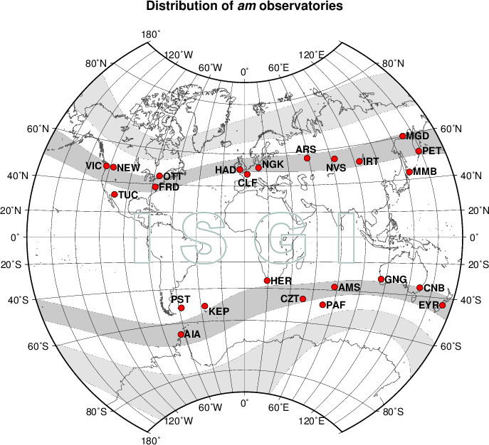
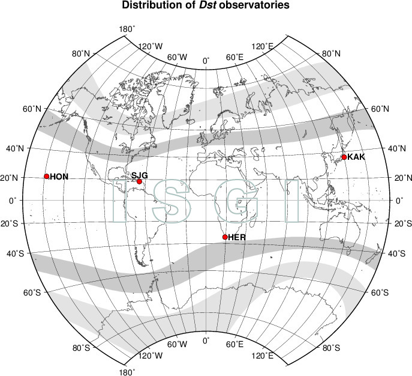

# Геомагнитные вариации

**Геомагнитная вариация** - разность между наблюдаемой величиной напряженности магнитного поля Земли и средним ее значением за какой-либо длительный промежуток времени под действием различных факторов.[1](http://www.wdcb.ru/stp/geomag/geomagnetic_variations.ru.html)\
**Индексы геомагнитной активности** - количественная мера геомагнитной активности, предназначенная для описания вариаций магнитного поля Земли, вызванных воздействием потока солнечной плазмы (солнечного ветра) на магнитосферу Земли, изменениями внутри магнитосферы и взаимодействием магнитосферы и ионосферы.

1.  Локальные индексы, вычисленные по данным одной обсерватории и говорящие о величине локальной по территории геомагнитной возмущенности: **С и K индексы**;
2.  Индексы, характеризующие геомагнитную активность на всей Земле (планетарные индексы): **Кp, ар, Ар, аm, Am, aa, Aa**;
3.  Индексы, отражающие интенсивность магнитной возмущенности от вполне определенного источника: **Dst, AЕ, РС**.

Все индексы вычисляются и публикуются по всемирному времени UT. Международная ассоциация геомагнетизма и аэрономии официально признает индексы: **aa, am, Kp, Dst, PC** и **AE**.
[2](https://isgi.unistra.fr/geomagnetic_indices.php)

-   **Индекс aa** — это показатель глобальной геомагнитной активности, рассчитываемый на основе 3-часовых интервалов, нормализованных по геомагнитной широте ±50°.\
    Индекс вычисляется на основании K-индексов, измеренных в двух почти диаметрально противоположных обсерваториях: Хартланд (Hartland) в Великобритании и Канберра (Canberra) в Австралии.\
    
    \
    
    Индекс выражается в нанотеслах (нТл).
    Суточное среднее значение индекса называется **Aa индексом**.

-   **Индекс am** — это показатель глобальной геомагнитной активности, рассчитываемый на основе данных 37 станций, расположенных в субавроральных зонах (\~50° геомагнитной широты) по всему миру.
    \
    Индекс выражается в нанотеслах (нТл).
    Суточное среднее значение индекса называется **Am индексом**. Индекс am обеспечивает более точную оценку геомагнитной активности благодаря учету данных со станций, охватывающих все долготы и оба полушария.

-   **Kp индекс** — показатель интенсивности геомагнитной активности в планетарном масштабе, используемый для оценки глобальных магнитных возмущений.
    Однако, из-за исторических особенностей, сеть обсерваторий Kp преимущественно ориентирована на Европу и Северную Америку.
    Индекс рассчитывается на основе данных 13 станций, расположенных между 44° и 60° геомагнитной широты: 11 в Северном полушарии и 2 в Южном.\

    \
    
    Значение Kp представляет собой среднее арифметическое трёхчасовых стандартизированных K-индексов этих обсерваторий.
    Индекс принимает 28 возможных значений в диапазоне от 0 до 9 с точностью до 1/3: 0о, 0+, 1-, 1о, 1+, 2-, … 8-, 8o, 8+, 9-, 9о.\
    Значения Kp, преобразованные в линейную шкалу в нанотеслах, образуют **ap индекс**, который изменяется в интервале от 0 до 400 нТл .
    Среднее значение ap индекса за сутки называется **Ap индексом**, который эквивалентен среднесуточной планетарной амплитуде возмущений магнитного поля Земли и выражается в диапазоне от 0 до 280 нТл.\
    С 1997 года индексы Kp, ap и Ap вычисляются в Потсдамском центре имени Гельмгольца.
    [3](https://kp.gfz-potsdam.de/en/data)

-   **Индекс Dst** - показатель оценки изменений магнитного поля Земли, вызванных кольцевыми токами в магнитосфере во время геомагнитных бурь.\
    Индекс рассчитывается как среднее значение изменений горизонтальной компоненты магнитного поля за 1-часовой интервал и определён на основе данных с четырёх низкоширотных обсерваторий, расположенных вдали от активных зон, влияющих на локальные магнитные возмущения.\

    \
    
    Для анализа геомагнитной активности в течение суток также используется **среднесуточное значение Dst**, которое вычисляется путём усреднения часовых значений за день.
    В магнитоспокойные дни его значение обычно составляет ± 20 нТл, а во время бурь может снижаться до −450 нТл.
    **Dst индекс** публикуется в Мировом центре данных по геомагнетизму в Киото.
    [4](https://wdc.kugi.kyoto-u.ac.jp/dstae/index.html)

-   **Индексы AE, AU, AL, AO** оценивают геомагнитную активность, особенно усиление токов в ионосфере, которые протекают вдоль границы аврорального овала.
    Эти индексы рассчитываются на основе данных 12 обсерваторий, расположенных на авроральных и субавроральных широтах, равномерно распределённых по долготе.\
    
    \
    
    Таким образом, эти индексы дают представление о магнитных возмущениях в зоне полярных сияний и в основном используются для анализа воздействия солнечного ветра и солнечных бурь на Землю, особенно в северном полушарии.

    -   **AU индекс** отражает максимальное положительное отклонение магнитного поля, связанное с восточным током, который движется вдоль полярной зоны на восток.
    -   **AL индекс** отображает максимальное отрицательное отклонение, связанное с западным током, который движется на запад.
    -   **AE индекс** — это сумма абсолютных значений AU и AL, показывающая суммарную магнитную возмущенность в зоне полярных сияний.
    -   **AO индекс** — это среднее значение AU и AL, представляющее собой центральную точку между этими отклонениями.

Индекс рассчитывается по данным, полученным за 1-минутные интервалы времени.
В настоящее время также публикуются в Мировом центре данных по геомагнетизму в Киото.

-   **Индекс PC** характеризует геомагнитные возмущения в полярной шапке, вызванные воздействием солнечного ветра и межпланетного магнитного поля на магнитосферу Земли. 
    Индекс рассчитывается отдельно для северного и южного полушария на основе данных одной геомагнитной станции, расположенной вблизи полярных регионов.
    Для северного полушария используется станция в Гренландии (Туле, Thule - THL), а для южного полушария — станция Восток (Vostok - VOS) в Антарктиде.\
    
    \
    
    Индекс рассчитывается по данным, полученным за 1-минутные интервалы времени.

# Солнечная активность

-   Число пятен
-   F10.7
-   Магнитные бури

# Ссылки

1.  [МЦД по СЗФ: Геомагнитные вариации.](http://www.wdcb.ru/stp/geomag/geomagnetic_variations.ru.html)
2.  [МАГА: Индексы геомагнитной активности.](https://isgi.unistra.fr/geomagnetic_indices.php)
3.  [Helmholtz Centre Potsdam GFZ German Research Centre for Geosciences](https://kp.gfz-potsdam.de/en/data)
4.  [World Data Center for Geomagnetism, Kyoto](https://wdc.kugi.kyoto-u.ac.jp/dstae/index.html)
5.  [МЦД по СЗФ: Солнечная активность](http://www.wdcb.ru/stp/solar/solar_activity.ru.html)
