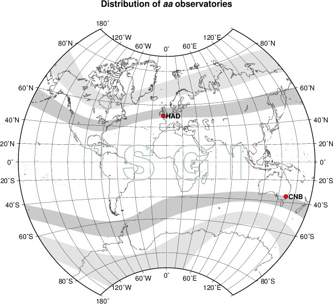
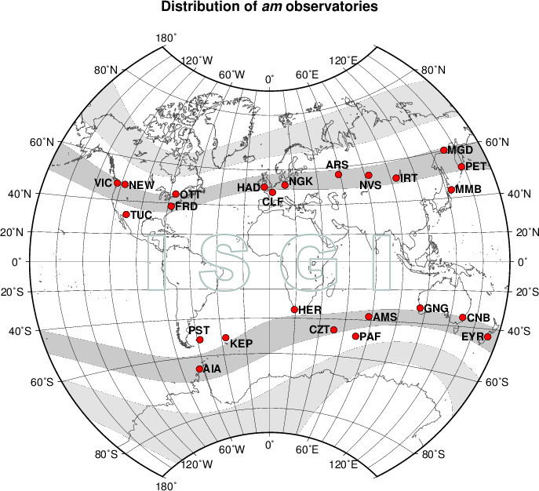
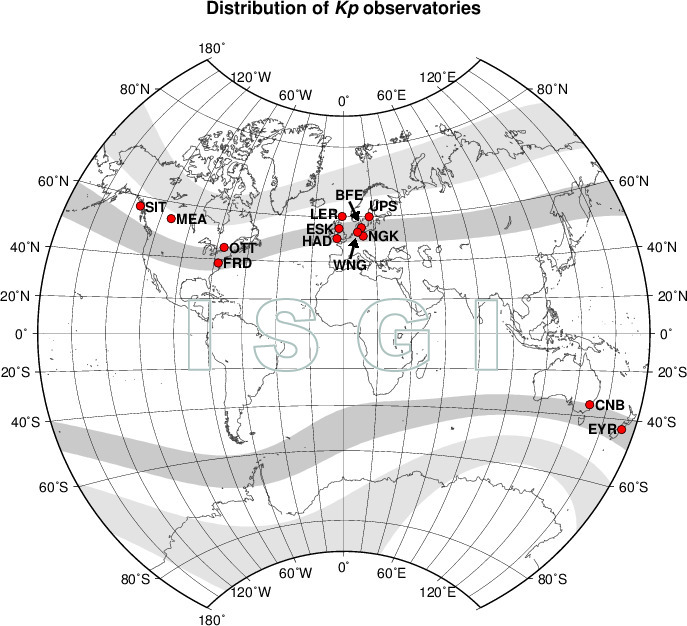
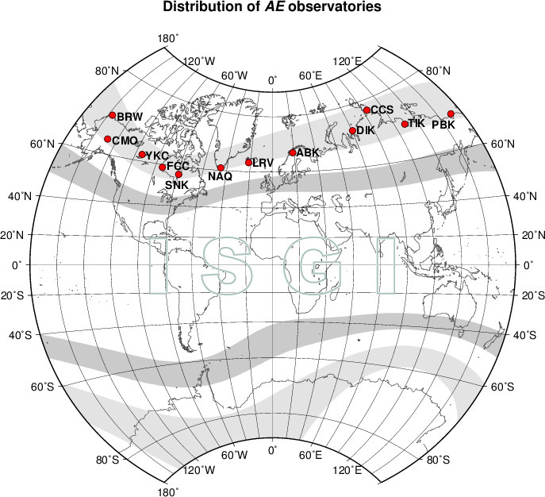
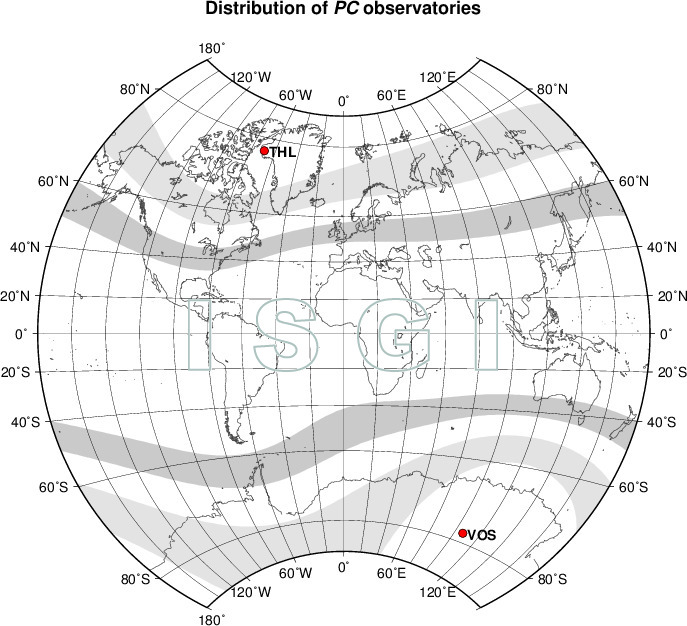

# **Project Structure**

## 1. **Dependency Setup**

To ensure the environment is reproducible and to install all necessary packages, use the script: [**Setup.R**](https://github.com/Eugene-van-Berd/GeoClimate_EMS/blob/master/scripts/Setup.R)

## 2. **`data` Folder:**

-   [`docs`](https://github.com/Eugene-van-Berd/GeoClimate_EMS/tree/master/data/docs): Storage for final documents generated during the R Markdown file rendering process.
-   `ems`: Private storage for sensitive ambulance call data. For access, contact via [**email**](eugenevanberd@gmail.com).
-   [`help`](https://github.com/Eugene-van-Berd/GeoClimate_EMS/tree/master/data/help): Storage for auxiliary information (images, descriptions, hints, etc.).
-   [`pics`](https://github.com/Eugene-van-Berd/GeoClimate_EMS/tree/master/data/pics): Storage for final plots automatically saved during R Markdown file rendering.
-   [`raw`](https://github.com/Eugene-van-Berd/GeoClimate_EMS/tree/master/data/raw): Storage for external databases.

## 3. **R Markdown Working Files:**

-   [**1. Transform.Rmd**](https://github.com/Eugene-van-Berd/GeoClimate_EMS/blob/master/1.%20Transform.Rmd): Transformation of raw data.
-   [**2. EDA.Rmd**](https://github.com/Eugene-van-Berd/GeoClimate_EMS/blob/master/2.%20EDA.Rmd): Exploratory Data Analysis (EDA).
-   [**3. Models.Rmd**](https://github.com/Eugene-van-Berd/GeoClimate_EMS/blob/master/3.%20Models.Rmd): Regression analysis.

## 4. **Rendering R Markdown Files to HTML:**

To render R Markdown files to the `data/docs` folder, use the script: [**Render.R**](https://github.com/Eugene-van-Berd/GeoClimate_EMS/blob/master/scripts/Render.R)

# **Literature Review**

## **Geomagnetic Variations**

**Geomagnetic variation** refers to the difference between the observed intensity of Earth's magnetic field and its average value over a long period, influenced by various factors.[1](http://www.wdcb.ru/stp/geomag/geomagnetic_variations.ru.html)\
**Geomagnetic activity indices** are quantitative measures of geomagnetic activity, designed to describe variations in Earth's magnetic field caused by the interaction of solar plasma (solar wind) with Earth's magnetosphere, internal magnetospheric changes, and the interaction between the magnetosphere and ionosphere. 1. **Local indices**, computed from data from a single observatory, indicating the magnitude of local geomagnetic disturbance: **C and K indices**; 2. **Planetary indices**, reflecting geomagnetic activity over the entire Earth: **Kp, ap, Ap, am, Am, aa, Aa**; 3. **Indices reflecting the intensity of magnetic disturbance from specific sources**: **Dst, AE, PC**.

All indices are calculated and published in Universal Time (UT). The International Association of Geomagnetism and Aeronomy officially recognizes the indices: **aa, am, Kp, Dst, PC**, and **AE**. [2](https://isgi.unistra.fr/geomagnetic_indices.php)

-   **aa Index** — a measure of global geomagnetic activity, calculated from 3-hour intervals, normalized to geomagnetic latitudes ±50°. The index is calculated based on K-indices measured at two nearly diametrically opposite observatories: Hartland (UK) and Canberra (Australia) and is expressed in nanoteslas (nT). The daily mean value of the index is called the **Aa index**.

    

-   **am Index** — a measure of global geomagnetic activity, calculated from data from 37 stations located in subauroral zones (\~50° geomagnetic latitude) around the world. The index is expressed in nanoteslas (nT). The daily mean value of the index is called the **Am index**. The am index provides a more accurate estimate of geomagnetic activity by considering data from stations covering all longitudes and both hemispheres.

    

-   **Kp Index** — a measure of geomagnetic activity on a planetary scale, used to assess global magnetic disturbances. However, due to historical reasons, the Kp observatory network is mainly focused on Europe and North America. The index is calculated based on data from 13 stations located between 44° and 60° geomagnetic latitude: 11 iJ,hmetic mean of 3-hour standardized K-indices from these observatories. The index has 28 possible values ranging from 0 to 9 with a precision of 1/3: 0o, 0+, 1-, 1o, 1+, 2-, … 8-, 8o, 8+, 9-, 9o. The Kp values, converted to a linear scale in nanoteslas, form the **ap index**, with values ranging from 0 to 400 nT. The daily mean value of the ap index is called the **Ap index**, which ranges from 0 to 280 nT. Since 1997, Kp, ap, and Ap indices have been calculated at the Potsdam Helmholtz Centre. [3](https://kp.gfz-potsdam.de/en/data)

    

-   **Dst Index** — a measure of changes in Earth's magnetic field caused by ring currents in the magnetosphere during geomagnetic storms. The index is calculated as the mean value of changes in the horizontal component of the magnetic field over 1-hour intervals, based on data from four low-latitude observatories located far from active zones influencing local magnetic disturbances. A daily mean value of the Dst index is also used, calculated by averaging hourly values for the day. During magnetically quiet days, its value is typically around ±20 nT, while during storms, it can drop to −450 nT. The **Dst index** is published by the World Data Centre for Geomagnetism in Kyoto. [4](https://wdc.kugi.kyoto-u.ac.jp/dstae/index.html)

    

-   **AE, AU, AL, AO Indices** evaluate geomagnetic activity, particularly the intensification of ionospheric currents flowing along the auroral oval boundary. These indices are calculated based on data from 12 observatories located at auroral and subauroral latitudes, evenly distributed by longitude. These indices provide information about magnetic disturbances in the auroral zone and are primarily used to analyze the impact of solar wind and solar storms on Earth, especially in the Northern Hemisphere.

    -   **AU index** reflects the maximum positive deviation of the magnetic field associated with the eastward current flowing along the polar zone.
    -   **AL index** represents the maximum negative deviation associated with the westward current flowing westward.
    -   **AE index** is the sum of the absolute values of AU and AL, indicating total magnetic disturbance in the auroral zone.
    -   **AO index** is the average of AU and AL, representing the central point between these deviations.

    Indices are calculated based on 1-minute data. They are currently also published by the World Data Centre for Geomagnetism in Kyoto.

    

-   **PC Index** describes geomagnetic disturbances in the polar cap caused by solar wind and interplanetary magnetic field interactions with Earth's magnetosphere. The index is calculated separately for the Northern and Southern Hemispheres based on data from one geomagnetic station located near the polar regions. For the Northern Hemisphere, the station used is in Greenland (Thule - THL), and for the Southern Hemisphere, the station is in Antarctica (Vostok - VOS). The index is calculated from 1-minute data.

    

## **Magnetic Storms**

Geomagnetic storms are disturbances of Earth's magnetic field caused by the interaction of solar wind with Earth's magnetosphere. These storms can last from several hours to several days and vary in intensity, measured by the **Dst** and **Kp** indices.

There are two types of storms based on their onset:

1.  **Storms with sudden onset (SSC - Storm Sudden Commencement):**
    -   Begin with a sharp increase in the geomagnetic field within one or two minutes, detected simultaneously at all stations around the world.
    -   Caused by a magnetohydrodynamic shock wave from the solar wind triggered by a solar flare, which compresses Earth's magnetosphere.
    -   The shock wave from the solar wind usually precedes the magnetic storm but not always! If the jump is not followed by further disturbances, this event is called a **Sudden Impulse (SI)**.
2.  **Storms with gradual onset:**
    -   Develop gradually, with a steady increase in geomagnetic field disturbances.
    -   The exact moment of onset for these storms is difficult to determine since disturbances at different stations may occur with noticeable time delays.

Data on SSC and SI events are recorded at five main and five additional observatories, with results published by the del-Ebre Observatory. [5](https://www.obsebre.es/en/variations/rapid#ssc) To assess the quality of events, the following classification is used:

-   **Code 3:** Unambiguous SC event with a sharp rhythm change, high amplitude, and clear form.

-   **Code 2:** SC confirmed, but without additional characteristics.

-   **Code 1:** Possible SC, requires confirmation from other stations.

-   **Code 0:** Does not meet SC criteria or weak visibility.

    

## **Solar Activity**

Solar activity refers to the entire range of observed non-stationary phenomena in the Sun's atmosphere, its radiation in different electromagnetic wavelength ranges, and particle fluxes of various energies. The degree of solar activity is characterized by specific indices, which are calculated from observations made with various instruments and provide insights into only a part of the complex picture of solar activity.

1.  **Sunspots**

**Sunspot number** is a widely used indicator of solar activity. [6](http://www.wdcb.ru/stp/solar/solar_activity.ru.html) Currently, a summary of all sunspot observations and the determination of the monthly and yearly average values of the **International Sunspot Number** are produced at the Solar Influences Data Center, Royal Observatory of Belgium in Brussels. [7](https://www.sidc.be/SILSO/datafiles)

2.  **Solar Radio Flux**

Following the discovery of solar radio emissions in 1947, a new solar activity index was introduced: the **F10.7 radio flux** with a wavelength of 10.7 cm (2800 MHz). It is measured in solar flux units: 1 sfu = 10\^-22 W/(m²·Hz).

This index characterizes changes in temperature and density across the entire visible solar disk and correlates well with changes in sunspot numbers.

Daily measurements of the radio flux **F10.7** have been carried out under the program of the National Research Council of Canada since 1947. Before May 31, 1991, the observations were made at the Algonquin Radio Observatory. Since June 1, 1991, the observations have been carried out at the Dominion Radio Astrophysical Observatory.

Results of the observations, including daily, monthly, and yearly mean values of the radio flux **F10.7**, are published on the website of the National Centers for Environmental Information, National Oceanic and Atmospheric Administration (NOAA). [8](http://www.wdcb.ru/stp/data/solar.act/flux10.7/daily/)

The data are presented in three forms: - **obs** – observed values, measured by the solar radio telescope; - **adj** – adjusted values for the Earth-Sun distance and normalized to the average distance; - **abs** – absolute values – adjusted values multiplied by 0.9.

## References

1.  [The World Data Center for Solar Terrestrial Physics: Geomagnetic Variations.](http://www.wdcb.ru/stp/geomag/geomagnetic_variations.html)
2.  [The International Service of Geomagnetic Indices: Geomagnetic indices.](https://isgi.unistra.fr/geomagnetic_indices.php)
3.  [Helmholtz Centre Potsdam GFZ German Research Centre for Geosciences](https://kp.gfz-potsdam.de/en/data)
4.  [World Data Center for Geomagnetism, Kyoto](https://wdc.kugi.kyoto-u.ac.jp/dstae/index.html)
5.  [Observatori de l'Ebre](https://www.obsebre.es/en/variations/rapid#ssc)
6.  [The World Data Center for Solar Terrestrial Physics: Solar Activity.](http://www.wdcb.ru/stp/solar/solar_activity.html)
7.  [Solar Influences Data Analysis Center - SIDC)](https://www.sidc.be/SILSO/datafiles)
8.  [National Centers for Environmental Information, NOAA](http://www.wdcb.ru/stp/data/solar.act/flux10.7/daily/)
