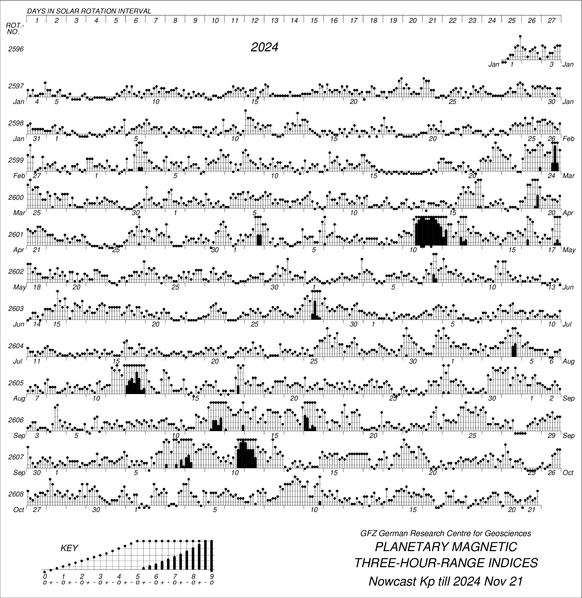

# [Геомагнитные вариации](http://www.wdcb.ru/stp/geomag/geomagnetic_variations.ru.html)

**Геомагнитная вариация** - разность между наблюдаемой величиной напряженности магнитного поля Земли и средним ее значением за какой-либо длительный промежуток времени под действием различных факторов.
Принято различать четыре вида магнитных вариаций:

-   *Вековые вариации* - связаны с процессами внутри Земли, происходят в течение длительных периодов времени;
-   *Годовые вариации* - изменения среднемесячных значений напряженности магнитного поля, характеризуются небольшой амплитудой;
-   *Суточные вариации* - связаны с солнечносуточными и лунносуточными изменениями напряженности геомагнитного поля из-за изменения солнечной активности;
-   *Магнитные возмущения* - непериодические импульсные вариации, магнитные бури, связанные с нерегулярными процессами в солнечном ветре и на Солнце.

## Индексы геомагнитной активности

**Индексы геомагнитной активности** - количественная мера геомагнитной активности, предназначенная для описания вариаций магнитного поля Земли, вызванных воздействием потока солнечной плазмы (солнечного ветра) на магнитосферу Земли, изменениями внутри магнитосферы и взаимодействием магнитосферы и ионосферы.

1.  Локальные индексы, вычисленные по данным одной обсерватории и говорящие о величине локальной по территории геомагнитной возмущенности: **С и K индексы**;
2.  Индексы, характеризующие геомагнитную активность на всей Земле (планетарные индексы): **Кp, ар, Ар, аm, Am, aa, Aa**;
3.  Индексы, отражающие интенсивность магнитной возмущенности от вполне определенного источника: **Dst, AЕ, РС**.

Все индексы вычисляются и публикуются по всемирному времени UT. Международная ассоциация геомагнетизма и аэрономии - [МАГА](http://isgi.unistra.fr/) официально признает индексы: ***aa, am, Kp, Dst, PC*** и ***AE***.

-   **aa индекс** - планетарный трехчасовой индекс геомагнитной активности, вычисляемый через данные, полученные в двух почти диаметрально противоположных магнитных обсерваториях в северном и южном полушариях - в настоящее время это Хартланд (Hartland) в Великобритании и Канберра (Canberra) в Австралии.
    Индекс измеряется в нанотеслах (нТл).
    Среднее значение индекса за сутки - **Aa индекс**.

-   ***am*** **индекс**  -

-   **Kp индекс** - планетарный индекс, характеризующий глобальную возмущенность магнитного поля Земли в трехчасовом интервале времени.
    Вычисляется на данных из 13 отобранных магнитных обсерваториях, расположенных в субавроральной зоне между 48 и 63 градусами северной и южной геомагнитных широт:\
    Kp индекс имеет 28 значений в диапазоне от 0 до 9 и определяется с точностью до 1/3:\
    0о, 0+, 1-, 1о, 1+, 2-, … 8-, 8o, 8+, 9-, 9о.
    [Наиболее наглядное представление Kp индекса](https://kp.gfz-potsdam.de/en/figures/bartels-music) - *музыкальная диаграмма Бартельса*.\
    Значения Kp, преобразованные к линейной шкале в нанотеслах, представляют из себя **ар индекс**, который изменяется в интервале от 0 до 400 нТл
    . **Ар индекс** получается осреднением восьми значений ар за день и эквивалентен среднесуточной планетарной амплитудой возмущения магнитного поля Земли с линейной шкалой от 0 до 280 нТл.\
    С 1997 г индексы Kp, ap и Ap определяются в Потсдамский центр имени Гельмгольца [**Helmholtz Centre Potsdam GFZ German Research Centre for Geosciences**](http://www.gfz-potsdam.de/en/kp-index/).

-   ***Dst индекс -***

-   ***PC индекс -***

-   ***AE, AU, AL, AО индексы -***

# [Солнечная активность](http://www.wdcb.ru/stp/solar/solar_activity.ru.html)

-   Число пятен
-   F10.7
-   Магнитная буря
