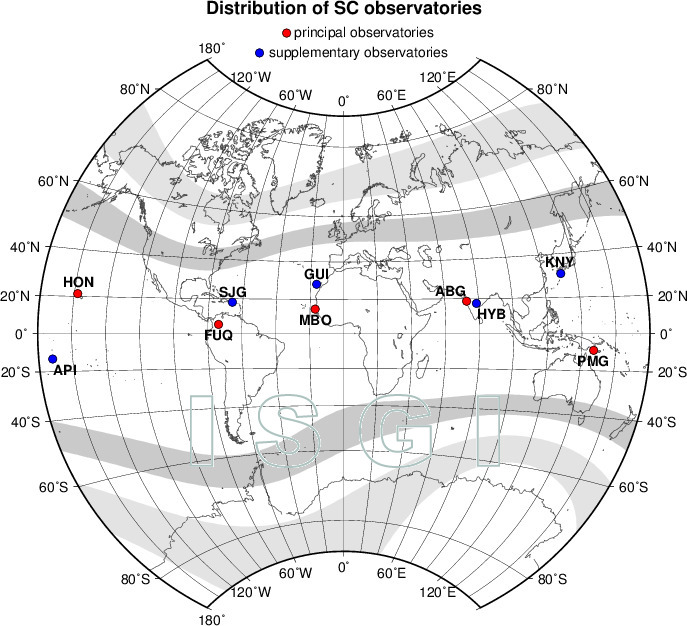

# Структура проекта

1.  **Папка `data`**:
    -   `docs`: хранение итоговых документов, сгенерированных при рендере Rmd-файлов.
    -   `help`: хранение вспомогательной информации (картинки, описания, подсказки и т.д.).
    -   `pics`: хранение итоговых графиков, автоматически сохраняемых при рендере Rmd-файлов.
    -   `raw`: хранение исходных данных (базы данных и предварительно подготовленные файлы для анализа).
2.  **Папка `scripts`**:
    -   Хранение рабочих скриптов (файлы R) и промежуточных отчетов (файлы Rmd).
3.  **Файл `GeoClimate_EMS.Rmd`**:
    -   Основной файл для создания итогового отчета.

# Литературный обзор

## Геомагнитные вариации

**Геомагнитная вариация** - разность между наблюдаемой величиной напряженности магнитного поля Земли и средним ее значением за какой-либо длительный промежуток времени под действием различных факторов.[1](http://www.wdcb.ru/stp/geomag/geomagnetic_variations.ru.html)\
**Индексы геомагнитной активности** - количественная мера геомагнитной активности, предназначенная для описания вариаций магнитного поля Земли, вызванных воздействием потока солнечной плазмы (солнечного ветра) на магнитосферу Земли, изменениями внутри магнитосферы и взаимодействием магнитосферы и ионосферы.
1.
Локальные индексы, вычисленные по данным одной обсерватории и говорящие о величине локальной по территории геомагнитной возмущенности: **С и K индексы**; 2.
Индексы, характеризующие геомагнитную активность на всей Земле (планетарные индексы): **Кp, ар, Ар, аm, Am, aa, Aa**; 3.
Индексы, отражающие интенсивность магнитной возмущенности от вполне определенного источника: **Dst, AЕ, РС**.

Все индексы вычисляются и публикуются по всемирному времени UT. Международная ассоциация геомагнетизма и аэрономии официально признает индексы: **aa, am, Kp, Dst, PC** и **AE**.
[2](https://isgi.unistra.fr/geomagnetic_indices.php)

-   **Индекс aa** — это показатель глобальной геомагнитной активности, рассчитываемый на основе 3-часовых интервалов, нормализованных по геомагнитной широте ±50°.\
    Индекс вычисляется на основании K-индексов, измеренных в двух почти диаметрально противоположных обсерваториях: Хартланд (Hartland) в Великобритании и Канберра (Canberra) в Австралии и выражается в нанотеслах (нТл).
    Суточное среднее значение индекса называется **Aa индексом**.

    

-   **Индекс am** — это показатель глобальной геомагнитной активности, рассчитываемый на основе данных 37 станций, расположенных в субавроральных зонах (\~50° геомагнитной широты) по всему миру.\
    Индекс выражается в нанотеслах (нТл).
    Суточное среднее значение индекса называется **Am индексом**.
    Индекс am обеспечивает более точную оценку геомагнитной активности благодаря учету данных со станций, охватывающих все долготы и оба полушария.

    

-   **Kp индекс** — показатель интенсивности геомагнитной активности в планетарном масштабе, используемый для оценки глобальных магнитных возмущений.
    Однако, из-за исторических особенностей, сеть обсерваторий Kp преимущественно ориентирована на Европу и Северную Америку.\
    Индекс рассчитывается на основе данных 13 станций, расположенных между 44° и 60° геомагнитной широты: 11 в Северном полушарии и 2 в Южном.\
    Значение Kp представляет собой среднее арифметическое трёхчасовых стандартизированных K-индексов этих обсерваторий.
    Индекс принимает 28 возможных значений в диапазоне от 0 до 9 с точностью до 1/3: 0о, 0+, 1-, 1о, 1+, 2-, … 8-, 8o, 8+, 9-, 9о.\
    Значения Kp, преобразованные в линейную шкалу в нанотеслах, образуют **ap индекс** с диапазоном от 0 до 400 нТл.\
    Среднее значение ap индекса за сутки называется **Ap индексом**, который выражается в диапазоне от 0 до 280 нТл.\
    С 1997 года индексы Kp, ap и Ap вычисляются в Потсдамском центре имени Гельмгольца.
    [3](https://kp.gfz-potsdam.de/en/data)

    

-   **Индекс Dst** - показатель оценки изменений магнитного поля Земли, вызванных кольцевыми токами в магнитосфере во время геомагнитных бурь.\
    Индекс рассчитывается как среднее значение изменений горизонтальной компоненты магнитного поля за 1-часовой интервал и определён на основе данных с четырёх низкоширотных обсерваторий, расположенных вдали от активных зон, влияющих на локальные магнитные возмущения.\
    Для анализа геомагнитной активности в течение суток также используется **среднесуточное значение Dst**, которое вычисляется путём усреднения часовых значений за день.
    В магнитоспокойные дни его значение обычно составляет ± 20 нТл, а во время бурь может снижаться до −450 нТл.\
    **Dst индекс** публикуется в Мировом центре данных по геомагнетизму в Киото.
    [4](https://wdc.kugi.kyoto-u.ac.jp/dstae/index.html)

    

-   **Индексы AE, AU, AL, AO** оценивают геомагнитную активность, особенно усиление токов в ионосфере, которые протекают вдоль границы аврорального овала.\
    Эти индексы рассчитываются на основе данных 12 обсерваторий, расположенных на авроральных и субавроральных широтах, равномерно распределённых по долготе.
    Таким образом, эти индексы дают представление о магнитных возмущениях в зоне полярных сияний и в основном используются для анализа воздействия солнечного ветра и солнечных бурь на Землю, особенно в северном полушарии.

    -   **AU индекс** отражает максимальное положительное отклонение магнитного поля, связанное с восточным током, который движется вдоль полярной зоны на восток.
    -   **AL индекс** отображает максимальное отрицательное отклонение, связанное с западным током, который движется на запад.
    -   **AE индекс** — это сумма абсолютных значений AU и AL, показывающая суммарную магнитную возмущенность в зоне полярных сияний.
    -   **AO индекс** — это среднее значение AU и AL, представляющее собой центральную точку между этими отклонениями.

    Индексы рассчитывается по данным, полученным за 1-минутные интервалы времени.\
    В настоящее время также публикуются в Мировом центре данных по геомагнетизму в Киото.

    

-   **Индекс PC** характеризует геомагнитные возмущения в полярной шапке, вызванные воздействием солнечного ветра и межпланетного магнитного поля на магнитосферу Земли.\
    Индекс рассчитывается отдельно для северного и южного полушария на основе данных одной геомагнитной станции, расположенной вблизи полярных регионов.
    Для северного полушария используется станция в Гренландии (Туле, Thule - THL), а для южного полушария — станция Восток (Vostok - VOS) в Антарктиде.\
    Индекс рассчитывается по данным, полученным за 1-минутные интервалы времени.

    

## Магнитные бури

Геомагнитные бури — это возмущения геомагнитного поля, вызванные взаимодействием солнечного ветра с магнитосферой Земли.
Они могут длиться от нескольких часов до нескольких суток и отличаются интенсивностью, измеряемой индексами **Dst** и **Kp**.

Различают два типа бурь по началу:

1.  **Бури с внезапным началом (SSC - Storm Sudden Commencement):**

-   Начинаются резким скачком геомагнитного поля в течение одной-двух минут, который фиксируется одновременно на всех станциях по всему миру.
-   Возникают в результате магнитогидродинамической ударной волны солнечного ветра, вызванной солнечной вспышкой, которая сжимает магнитосферу Земли.
-   Ударная волна солнечного ветра обычно предшествует магнитной буре, но не всегда! Если скачок не сопровождается дальнейшими возмущениями, это явление называют **внезапным импульсом (SI - Sudden Impulse).**

2.  **Бури с постепенным началом:**

-   Развиваются плавно, с постепенным усилением возмущений геомагнитного поля.
-   Точный момент начала бурь этого типа определить сложно, поскольку возмущения на разных станциях могут возникать с заметным временным сдвигом.

Данные о событиях SSC и SI фиксируются в пяти основных и пяти дополнительных обсерваториях, результаты которых публикуются обсерваторией дель-Эбре.
[5](https://www.obsebre.es/en/variations/rapid#ssc) Для оценки качества событий используется следующая классификация:

-   Код 3: Однозначное событие SC с резким изменением ритма, высокой амплитудой и выраженной формой.

-   Код 2: SC подтверждено, но без дополнительных характеристик.

-   Код 1: Возможное SC, требует подтверждения с других станций.

-   Код 0: Несоответствие критериям SC или слабая заметность.

    

## Солнечная активность

Солнечная активность - вся совокупность наблюдаемых нестационарных явлений в атмосфере Солнца, его излучении в разных диапазонах электромагнитных волн и потоках частиц различных энергий.
Степень солнечной активности характеризуется определенными индексами, которые вычисляются по результатам наблюдений на различных приборах и дают представление только о части сложной картины солнечной активности.\

1.  **Солнечные пятна**

**Число солнечных пятен** — широко используемый показатель солнечной активности.
[6](http://www.wdcb.ru/stp/solar/solar_activity.ru.html)\
В настоящее время сводка всех наблюдений пятен на Солнце и определение среднемесячных и среднегодовых значений **Международного числа солнечных пятен** производится в Центре анализа данных по влиянию Солнца Королевской обсерватории Бельгии в Брюсселе.
[7](https://www.sidc.be/SILSO/datafiles)\

2.  **Поток радиоизлучения Солнца**

После открытия радиоизлучения Солнца в 1947 г.
введён новый индекс солнечной активности – поток радиоизлучения **F10.7** c длиной волны 10.7 см (2800 МГц).
Он измеряется в солнечных единицах потока: 1 с.е.п.
= 10-22 Вт/(м2·Гц).

Данный индекс характеризует изменения температуры и плотности на всём видимом диске Солнца и хорошо коррелируют с изменениями числа солнечных пятен.

Ежедневные измерения радиоизлучения **F10.7** выполняются по программе Национального Исследовательского Совета Канады с 1947 г.
До 31 мая 1991 года наблюдения проводились в радиообсерватории Алгонквин.
С 1 июня 1991 года наблюдения ведутся в Радиоастрофизической обсерватории Доминиона.

Результаты наблюдений в виде ежедневных, среднемесячных и среднегодовых значений потока радиоизлучения F10.7 публикуются на
сайте Национальных центров экологической информации Национального Департамента по океану и атмосфере США 
[8](http://www.wdcb.ru/stp/data/solar.act/flux10.7/daily/)

Данные представлены в трех видах:

-   obs – наблюденные значения, измеренные солнечным радиотелескопом;
-   adj – скорректированные значения на изменение расстояния Земля - Солнце и приведенные к среднему расстоянию;
-   abs – абсолютные значения – скорректированные значения, умноженные на 0.9.

## Ссылки

1.  [МЦД по СЗФ: Геомагнитные вариации.](http://www.wdcb.ru/stp/geomag/geomagnetic_variations.ru.html)
2.  [МАГА: Индексы геомагнитной активности.](https://isgi.unistra.fr/geomagnetic_indices.php)
3.  [Helmholtz Centre Potsdam GFZ German Research Centre for Geosciences](https://kp.gfz-potsdam.de/en/data)
4.  [World Data Center for Geomagnetism, Kyoto](https://wdc.kugi.kyoto-u.ac.jp/dstae/index.html)
5.  [Observatori de l'Ebre](https://www.obsebre.es/en/variations/rapid#ssc)
6.  [МЦД по СЗФ: Солнечная активность и межпланетная среда](http://www.wdcb.ru/stp/solar/solar_activity.ru.html)
7.  [Solar Influences Data Analysis Center - SIDC)](https://www.sidc.be/SILSO/datafiles)
8.  [National Centers for Environmental Information, NOAA](http://www.wdcb.ru/stp/data/solar.act/flux10.7/daily/)
